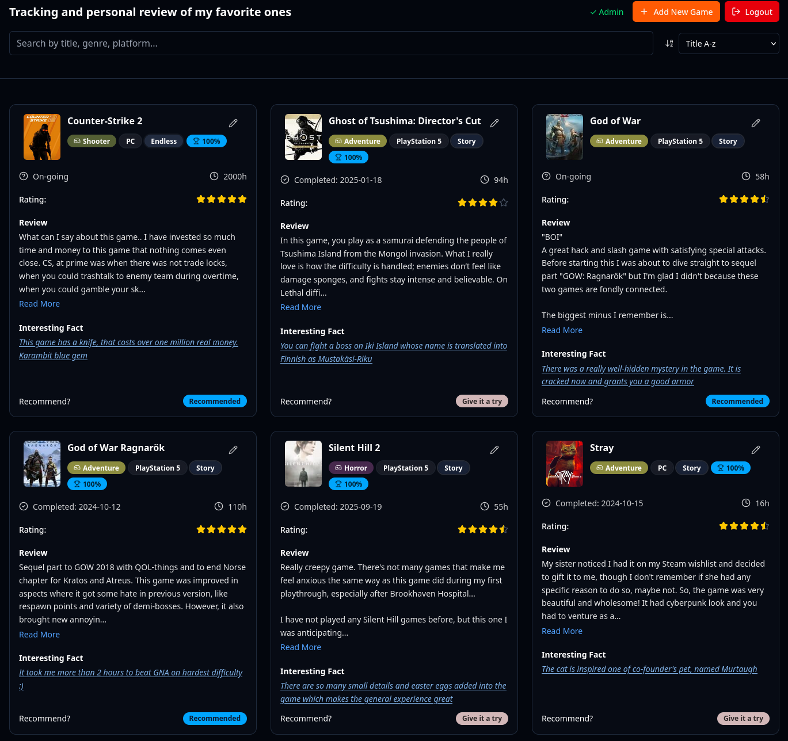
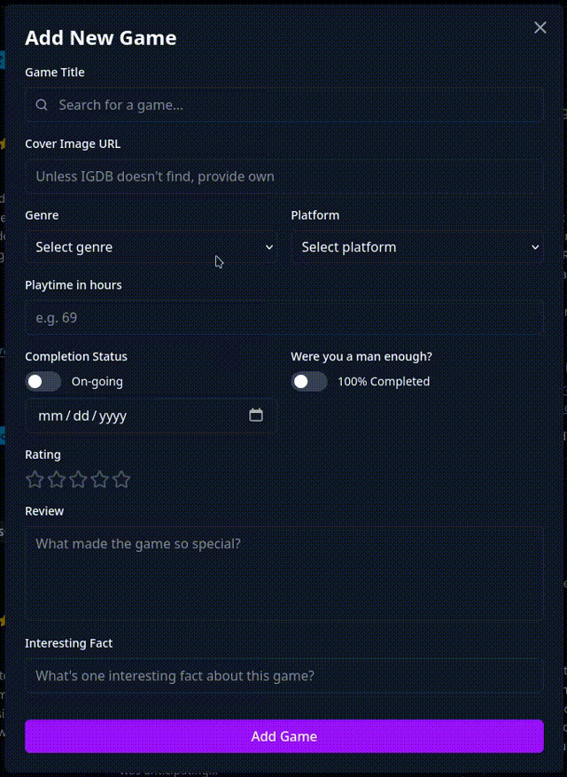

# Loopy Games - personal backlog for my favorite video games
This is my way to keep track of video games that have left a strong impression in me and that I could happily recommend for others to try too.

Here is a picture of how it looks like:

## A video showcasing how adding a game looks like

## Project tech stack

* Frontend
    * React & TypeScript
* Styling
    * TailwindCSS + shadcn
* Backend
    * Node.js & Express
* Database
    * MongoDB
* API
    * Twitch IGDB API

### Why and what I learned?

Ok, so this type of project has been in my mind for a while now and I finally got myself around the project. This is also something I have never done before, a full-stack project with serious API integration from a massive platform and routing everything but it definitely has been a great learning experience, especially learning more about backend and different auth methods.

### Frontend first

As usual, I started with what I was feeling the most comfortable with, the UI design with TypeScript and TailwindCSS. Creating clean and modern UI along with dummy data to see how it looks. I didn't want to spend too much time on this because you can go nuts and keep adding more and more stuff.

### Then the backend

Moving to the backend was a challenge. Concepts like endpoints, async code, user authentication and Express were bit unfamiliar to me. I’ll admit I leveraged AI tools to help bridge the gap; I realized mid-way that maybe the scale of this project was a too big jump from my previous work. To ensure I actually understood the "why" behind the code, I started to get myself more comfortable with backend studies on youtube and freecodecamp :-D

### Mongooooo

Lastly I included MongoDB where I could store data and make it live on my page. It was my first project where I tried MongoDB and the installation and integration process went smoothly. IGDB API provides data in JSON so MongoDB was pretty solid for this job. I used mongoose to handle schemas, making the management easier as the library grows bigger.

## Final thoughts

Creating this full-stack project was a great learning experience. It introduced me to so many new architectural patterns and considerations that I’ll definitely carry over to my future projects.

This journey really sparked my interest in **Node.js** and backend development in general. I’m already planning a few dedicated Node.js projects to master the core concepts and get more comfortable with async programming, as I’ve realized just how critical it is for building scalable applications.
From frontend to backend, ah classic. 

Also, I know it would be a cool thing to let others keep backlog of their own as well, but that's currently not what I am trying to achieve with this project.

## TODO

- [ ] Create About this page component
- [x] Fix results showing after selecting a game
- [ ] Instead of alert for adding a game, make a toast on corner of screen.
- [ ] Improve usability on phone